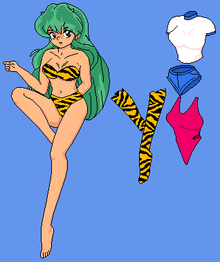

## Folder structure

A ZIP file's contents must be exactly like the folder, with no subdirectories. The folder must contain at least one `lisp` file describing the doll itself, and at least one `png` file for the doll to use, plus anything else. Very simple, then.

## S-Expression structure

A doll configuration file is a single [S-expression](https://en.wikipedia.org/wiki/S-expression), containing at least one `cels` form. Other supported forms are `screen`, `events`, `background`, `default-on`, and **TBD**.

### `screen`

The `screen` form is simple. It takes two integer arguments defining the size of the playfield. That's all there is to it. By default, the playfield is 480 by 400 pixels (448 by 320 in KiSS/GS).

### `cels`

The `cels` form takes a list with the following items:

* `file`: the base name of the cel's image. The `.png` extension is implied.
* `id`: used to build multi-cel parts and for scripting. If missing, `file` is used as an identifier instead.
* `partof`: the ID of another cel, used to build multi-cel parts.
* `pos`: the starting position for the part. See below.
* `offset`: a two-value list to specify an extra offset for this cel as part of a multi-cel part, so you can crop your PNG files.
* `fix`: a value determining how many attempts are needed before the part comes off and can be moved freely. A value of 9999 or higher makes it permanently stuck.
* `locked`: a clearer alternative to `fix 9999` that does not take any arguments.
* `alpha`: a value from 0 to 255 to determine the opacity of the cel. PNG already allows this but this lets you *change* the cel's opacity on the fly.
* `ghost`: when set, the cel can't be clicked at all.
* `unmapped`: makes the cel start out invisible, as if you used an `unmap` command in the `initialize` script event.
* `on`: a string value listing which sets this cel is present on.

Any time you use `partof` to add a cel to an already-defined part, you *can* leave off any arguments that would affect that part, such as `pos`, `fix`, and `locked`. In KiSS/GS it's common for something fixed to all have the same value repeated for every cel. You don't need to do this here. If you do, the new value will replace whatever it was set to before.

As such:

````clojure
(cels
    (file "pants") ; Defines a part "pants", with a cel "pants", using "pants.png", starting in the top-left corner.
	(file "hair" partof "body") ; Defines a part "body", with a cel "hair", using "hair.png".
    (file "front-arm" partof "body") ; Adds a cel "front-arm", using "front-arm.png", to the "body" part that "hair" started.
    (file "body" id "main-body" partof "body") ; Adds a cel "main-body", using "body.png", to the "body" part.
    
    (file "logo" pos (300 170) ghost) ; Adds a "logo" part at the specified position in the playfield that can't be clicked on.
    (file "balloon" pos (16 16) locked on "479") ; Adds a "balloon" part that can be clicked but not moved, on sets 4, 7, and 9.
    (file "undies" pos (52 90) fix 10) ; Adds an "undies" part that can't be moved until you try it ten times.
    (file "undies-behind" partof "undies" fix 16) ; Adds a back side to the "undies" part but also makes it take 16 clicks.
)
````

The  `pos` argument is a little intricate. It can take a single two-value -- `pos (16 16)` -- and the part will appear on that exact spot in all ten sets, or it can take a list of position values, one for each set, in which case:

* An `(x y)` coordinate pair works as it should, setting the part's position for that set.
* An `(x y >)` coordinate pair with a `>` added copies that position to all further sets. `pos (12 34)` is in fact equivalent to `pos ((12 34 >))`.
* A single `*` copies the coordinate for the first set. If this *is* the first set, it's equal to `(0 0)`.

Therefore, an expression like `pos ((556 22) (561 76) (561 76) (316 88 >) (561 76))` would set the first set's coordinates to 556 by 22, the second and third to 561 by 76, the fourth to 316 by 88, the fifth to 561 by 76 again, and the sixth through tenth to 316 by 88 again, because that one had a `>`.

### `background`

Optional. If it's left out, the background for all sets will be a lovely cornflower blue. This form can take either a list of *background definitions*, or one of them directly. A background definition is one of the following:

* An RGB triplet;
* The symbol `gradient` followed by two RGB triplets and optionally an angle in degrees;
* A string literal with the name of a PNG file, without the `.png` extension at the end;
* The same, but with the symbol `tiled` afterwards;

Whichever background is first in the list is used for all sets that don't have one set up. That is, if you have a doll with ten sets but only three background definitions, the latter seven sets will use the background for the first set.

As a single background:

```clojure
(background "party")
```

As a series

```clojure
(background  ;<-from-> <---to---> deg
	(gradient 39 89 91 34 204 221 45) ;set 0, also used for sets 4-10 if available
	(gradient 24 24 24 103 33 68) ;set 1, 90 degrees is implied
	("party")
	(34 204 221)
)
```

**TODO**: *Consider allowing using `System.Drawing.KnownColor` entries by name, like `(background aliceblue)`*

### `default-on`

Simply specifies which sets a cel should appear on if the `on` argument is not used:

```clojure
(default-on "0123") ; Now every cel without an `on` argument is implied to have an `on "0123"`.
(cels
    (file "magic-wand") ; Appears on sets 0, 1, 2, and 3, but not 4 and higher.
    ; Imagine more cels here, all of them without an `on`.
	(file "balloon" on "2") ; Only appears on set 2, none of the others.
)
```

### `events`

The `events` form likewise takes a list, this time of event structures. Each event starts with an *event trigger* form, followed by any number of *command* forms. See *Scripting* below for more information.

## Functional Example

```clojure
(
	(screen 640 400) ;sets the playfield size
    (background 100 149 237) ;sets the background color
    ;(background gradient 100 149 237 67 100 160 45) ;use a gradient at a 45-degree angle as the background
	(cels
		(file "shorts" offset (0 2) pos (240 94))
		(file "shirt" offset (0 2) pos (240 16))
		(file "suit" id "bathing suit" pos ((240 140) (260 160) (280 180)) on "012")
		(file "leftleg" pos (200 128))
		(file "rightleg" pos (160 128))
		(file "bottom" pos (73 131) fix 4)
		(file "top" pos (61 92) fix 4)
		(file "base" pos (4 4) locked)
		(file "shorts_" partof "shorts" offset (6 0))
		(file "shirt_" partof "shirt" offset (27 0))
	)
	(events
        ; Long form, specifying the same parts again.
		((collide "bathing suit" "base")
			(moverel "bathing suit" "base" 57 66)
        )
        ; Short form -- whatever collided is implied for the moverel command.
		((collide "shirt" "base") (moverel 54 59))
		((collide "shorts" "base") (moverel 66 121))
		((collide "top" "base") (moverel 57 88))
		((collide "bottom" "base") (moverel 69 127))
		((collide "rightleg" "base") (moverel 25 140))
		((collide "leftleg" "base") (moverel 54 231))
	)
)

```

Given matching cell images the above configuration may look a little like this:



## Scripting

Scripting is inspired by the [FKiSS standard](http://tigger.orpheusweb.co.uk/KISS/fkref4.html), reworked into a Lisp style. Several events are legal to specify, but only the listed ones actually trigger.

**TODO**: *Explain what object references are, and how property calls work.*

### Event triggers

#### `(alarm <number, string, or symbol>)`

Triggered when the specified timer runs out. 

#### `(catch cel)`

Triggered when the user presses on a cel ~~or part~~, and the part is unfixed.

#### `(collide <part> <part>)`

Triggered when the user releases a part such that it touches another, pixel-wise. The variables `#A` and `#B` are set for your convenience.

#### `(drop <cel>)`

Triggered when the user releases a cel ~~or part~~, and the part is unfixed.

#### `(fixcatch cel)`

Triggered when the user presses on a cel ~~or part~~, and the part unfixed.

#### `(fixdrop <cel>)`

Triggered when the user releases a cel ~~or part~~, and the part is fixed.

#### `(initialize)`

Triggered right after loading the doll.

#### `(in <part> <part>)`

In all respects the same as `collide`, but rectangular instead of pixel-wise.

#### `(press cel)`

Triggered when the user presses on a cel ~~or part~~, regardless of its fix value, if no `catch` or `fixcatch` happened first.

#### `(release <cel>)`

Triggered when the user releases a cel ~~or part~~, regardless of its fix value, if no `drop` or `fixdrop` happened first.

### Functions

#### `(<math operator> <numbers>)`

The math operations `+`, `-`, `/`, and `*` are available, and take any number of operands, which may be variables with numerical values, or function calls that return numbers.

#### `(= <variable> <any value>)`

Sets the specified variable, a symbol that is not already a command's name, to any legally-expressible value. Though `true` and `false` are technically variables, they are read-only.

#### `(<comparison operator> <number> <number>)`

The comparison operations `==`, `!=`, `<`, `<=`, `>`, and `>=` are available, and compare any two expression that evaluate to numbers with each other, returning `true` or `false` accordingly.

#### `(altmap <cel or part>)`

By the same rules as `map`, all target cels have their visibility toggled.

#### `(cels <cel>)`

Since string IDs can refer to both cels and parts, and one ID can refer to either at once, the `cels` command can be used to *explicitly* return a cel object reference for the cel with that name. It may also return a list object reference if that ID refers to multiple cels, which is also a thing that can happen.

**TODO**: *Add a `(list?)` function to help catch the latter case, and something to handle the `null` case.*

#### `(foreach (<list> <var>) ...)`

Given a list object reference, sets the specified variable to each list item in turn and executes the statements inside.

```clojure
; Displays the names of the component cels of the "body" object.
(= objectRef (part "body")) ; Get the "body" part as an object reference.
(= theCels (objectRef cels:)) ; Do a property call to get a list of cels.
(foreach (theCels c)
	(notify c)
)
```

#### `(ghost <cel or part> [<bool>])`

By the same rules as `map`, all target cels are made utterly unclickable. If a `true` or `false` is given, or an expression that evaluates as such, they'll be made unclickable if `true`, otherwise they'll start responding to clicks again.

#### `(if <expression> ...)`

Given an expression that evaluates to a number, executes the statements inside if that number is truthy (1 or higher). You can use an `else` symbol to specify what should happen otherwise.

```clojure
(if (mapped? "thing")
	(notify "The thing is mapped.")
    ; Could do more things if we wanted.
else
    (notify "The thing is NOT mapped.")
)
```

#### `(map <cel or part>)`

If the argument is a cel or list of them, turns them visible. If it's a part, all of its component cels are mapped.

#### `(mapped? <cel or part>)`

If the argument is a cel, returns `true` if it's mapped, `false` otherwise. If the argument is a part, returns `true` only if *all* its component cels are mapped.

#### `(moverel <part> <part> <number> <number>)`

Basically a shorthand for FKiSS' `movebyx`/`movebyy` commands, moves the first part somewhere relative to the second. The parts may be left out, in which case the `#A` and `#B` variables are assumed.

#### `(moveto <part> <number> <number>)`

Moves the given part to a new absolute position. The part may be left out, in which case the `#A` variable is assumed.

#### `(music <media filename>)`

Causes the given sound file to play in the background, on a loop, until another song is requested.

**TODO**: *Add something to stop it afterwards without playing another song.*

#### `(not <numerical expression>)`

Given an expression that evaluates to a number, returns 1 if that expression is equal to 0, or 0 if it's 1 or higher.

#### `(notify <string>)`

Displays the given string (or string representation of any value, really) in a message box.

#### `(nummapped <cel or part>)`

If the argument is a cel, returns 1 if it's mapped, 0 otherwise. If the argument is a part, returns the number of component cels that are mapped.

#### `(part <part>)`

Since string IDs can refer to both cels and parts, and one ID can refer to either at once, the `part` command can be used to *explicitly* return a part object reference for the part with that name. Unlike `cels`, this will never return a list.

**TODO**: *Add something to handle the `null` case.*

#### `(random <number> <maybe another number>)`

If one number is given, returns a random value from 0 to that number, exclusive. If two are given, returns a number between those two.

#### `(sound <media filename>)`

Causes the given sound file to play, once. Returns a sound object reference.

#### `(stopsound <sound object reference>)`

Stops the given sound.

#### `(timer <number, string, symbol, or expression list> <delay number> [repeat]>`

Sets a timer to go off after `delay`. If the second parameter is a number, string, or symbol, a matching `alarm` event is triggered. If it's an expression list, its contents will serve as the `alarm` event. If `repeat` is given, the timer will trigger continuously in `delay` intervals.

```clojure
; Every 25 ticks, move object "one" two pixels to the right of "other" using an anonymous callback instead of an alarm.
(timer
	(
		(moverel "one" "other" 2 0)
        ; Could do more things here if we wanted.
	)
	25 repeat
)
```

#### `(unmap <cel or part>)`

By the same rules as `map`, all target cels are made invisible/unmapped.

