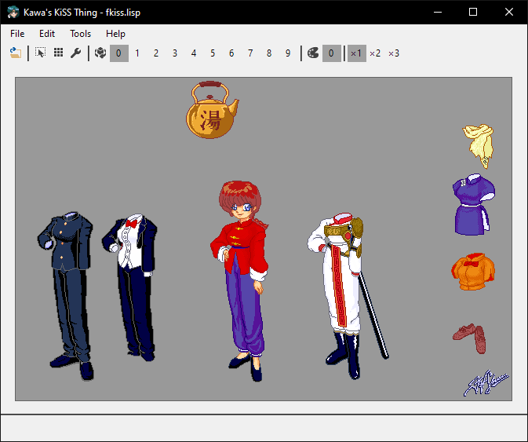

# Kawa's So-Far Unnamed KiSS Thing

## What?

KiSS, or the *Kisekae Set System* is an old digital version of those little paper dress-up dolls, or *kisekae ningyō* (着せ替え 人形). It's so old, it was first seen back on the NEC PC-9800! And that of course brings some historical baggage. For example, besides the bespoke configuration file format, the actual graphics are in a unique format that's *only* used by KiSS. These graphics originally could only be in 16 colors, then 256, but it wasn't until later that 32-bit RGBA graphics would be added... by extending the original format again. KiSS sets can contain scripts for interactivity, but that too just adds onto the old configuration file format as specially-formed comment lines, as do many other later features.

Because of this, especially the difficulty in creating `cel` files, Kawa decided to just write his own KiSS thing, with `png` graphics and an easy to parse and extend configuration format. Originally this was a JSON file, but the need for scripting quickly inspired a switch to Lisp [S-Expressions](https://en.wikipedia.org/wiki/S-expression), since that way the script code and the set definition can be handled by a single file parser.

## Features

* Uses regular `png` files instead of `cel`, and `zip` files instead of  `lzh`. Therefore, no specialized tools are needed to create a doll.
* Supports Windows 10 dark and light modes.
* Scripting capability roughly equal to FKiSS level 1, plus nice things like conditional expressions of arbitrary complexity and functions that can return values.
* Quick reload to speed up doll development.
* Supports a great many sound file formats via FMOD (optionally).

## Further Information

See [the docs folder](docs) for more information on the doll file structure.

## Work in Progress

While basic doll manipulation is pretty much done, scripting is not. I have a separate project, not in source control, to convert KiSS/GS dolls to this format, but the results still needs a lot of polish. I used that to port the `2ranmas` set. I also need a good pack-in set or two, preferably original work that can use the new features.

## Extra Credit

* FMOD by Firelight Technologies: https://www.fmod.com/
* DarkUI by Robin Perris: https://github.com/RobinPerris/DarkUI
